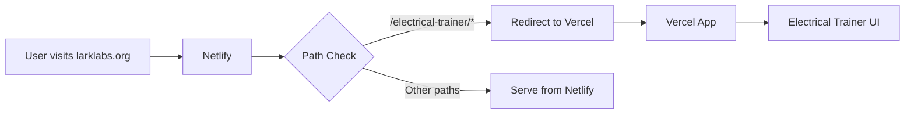

# 🚀 Deployment Guide - LARK Labs Electrical Trainer

## 📋 Deployment Architecture

This project uses a **dual-deployment strategy**:

- **Main Website**: Deployed to **Netlify** (larklabs.org)
- **Electrical Trainer App**: Deployed to **Vercel** (electrical-trainer.vercel.app)
- **Integration**: Netlify redirects `/electrical-trainer/*` to Vercel app

## 🌐 Netlify Deployment (Main Website)

### Setup Instructions

1. **Connect Repository**
   ```bash
   # Repository: https://github.com/MikeKapin/LarkLabs-hvac
   # Branch: main
   ```

2. **Build Settings**
   ```yaml
   Build command: echo 'No build step required for main website'
   Publish directory: . (root directory)
   Functions directory: netlify/functions
   ```

3. **Environment Variables** (Optional)
   ```bash
   NODE_ENV=production
   ```

4. **Custom Domain**
   - Primary: `larklabs.org`
   - HTTPS: Automatically enabled
   - Redirects configured in `netlify.toml`

### Features Enabled
- ✅ **Automatic Deployments**: Every push to `main` branch
- ✅ **HTTPS**: SSL certificate auto-provisioned
- ✅ **Redirects**: `/electrical-trainer/*` → Vercel app
- ✅ **Security Headers**: Content security, XSS protection
- ✅ **Asset Caching**: Optimized cache headers for static files
- ✅ **Functions**: Serverless functions in `netlify/functions/`

### Deploy Commands
```bash
# Manual deploy (if needed)
npm run deploy:netlify

# Preview deploy
netlify deploy --dir=. --open
```

## ⚡ Vercel Deployment (Electrical Trainer App)

### Setup Instructions

1. **Connect Repository**
   ```bash
   # Repository: https://github.com/MikeKapin/LarkLabs-hvac
   # Framework: Vite
   # Root Directory: apps/electrical-trainer
   ```

2. **Build Settings**
   ```yaml
   Build Command: npm run build
   Output Directory: dist
   Install Command: npm install
   Development Command: npm run dev
   Node.js Version: 18.x
   ```

3. **Environment Variables**
   ```bash
   NODE_ENV=production
   VITE_APP_NAME=Electrical Diagnosis Trainer
   VITE_APP_VERSION=1.0.0
   VITE_API_BASE_URL=https://larklabs.org/api
   ```

4. **Custom Domain** (Recommended)
   - Primary: `electrical-trainer.larklabs.org`
   - Alternative: `electrical-trainer.vercel.app`

### Features Enabled
- ✅ **Automatic Deployments**: Every push to `main` branch
- ✅ **Preview Deployments**: Every pull request
- ✅ **Edge Runtime**: Global CDN distribution
- ✅ **Analytics**: Web Vitals monitoring
- ✅ **Security**: Automatic security headers
- ✅ **PWA Support**: Service worker and offline capabilities

### Deploy Commands
```bash
# Install Vercel CLI
npm i -g vercel

# Deploy to preview
cd apps/electrical-trainer
vercel

# Deploy to production
vercel --prod
```

## 🔄 Integration Flow



## 📊 Monitoring & Analytics

### Netlify Analytics
- **Site Traffic**: Page views, unique visitors
- **Build Performance**: Deploy time, success rate
- **Function Usage**: Serverless function metrics
- **Bandwidth**: Data transfer monitoring

### Vercel Analytics
- **Web Vitals**: Core performance metrics
- **Real User Monitoring**: Actual user experience
- **Error Tracking**: Runtime error monitoring
- **Edge Performance**: Global response times

## 🛠️ Development Workflow

### Local Development
```bash
# Start main website
npm run dev

# Start electrical trainer app
cd apps/electrical-trainer
npm run dev
```

### Testing Before Deploy
```bash
# Build and test main website
npm run build
npm run preview

# Build and test electrical trainer
cd apps/electrical-trainer
npm run build
npm run preview
```

### Branch Strategy
- **main**: Production deployments
- **develop**: Staging deployments (optional)
- **feature/***: Feature branches for development

## 🔒 Security Configuration

### Netlify Security Headers
```toml
# netlify.toml
[[headers]]
for = "/*"
[headers.values]
  X-Frame-Options = "DENY"
  X-Content-Type-Options = "nosniff"
  X-XSS-Protection = "1; mode=block"
  Referrer-Policy = "strict-origin-when-cross-origin"
```

### Vercel Security
```json
// vercel.json
{
  "headers": [
    {
      "source": "/(.*)",
      "headers": [
        {"key": "X-Frame-Options", "value": "DENY"},
        {"key": "X-Content-Type-Options", "value": "nosniff"}
      ]
    }
  ]
}
```

## 🚨 Troubleshooting

### Common Issues

#### Netlify Deploy Fails
```bash
# Check build logs in Netlify dashboard
# Verify netlify.toml syntax
# Ensure all dependencies are in package.json
```

#### Vercel Build Fails
```bash
# Check build logs in Vercel dashboard
# Verify vite.config.ts configuration
# Ensure all TypeScript errors are resolved
```

#### Redirect Not Working
```bash
# Verify netlify.toml redirect configuration
# Check Vercel domain configuration
# Test redirect manually: curl -I https://larklabs.org/electrical-trainer/
```

#### Assets Not Loading
```bash
# Verify public/ folder structure
# Check asset paths in code
# Ensure proper base URL configuration
```

## 📈 Performance Optimization

### Netlify Optimizations
- **Asset Compression**: Gzip/Brotli enabled automatically
- **Edge Caching**: CDN with global distribution
- **Image Optimization**: Automatic WebP conversion
- **Preloading**: Critical resources preloaded

### Vercel Optimizations
- **Code Splitting**: Automatic route-based splitting
- **Tree Shaking**: Dead code elimination
- **Bundle Analysis**: Built-in bundle analyzer
- **Edge Functions**: Serverless at the edge

## 🔍 Testing Deployments

### Automated Tests
```bash
# Lighthouse CI for performance
npm run lighthouse

# Link checking
npm run check-links

# Accessibility testing
npm run a11y-test
```

### Manual Testing Checklist
- [ ] Main website loads correctly
- [ ] Electrical trainer app loads via redirect
- [ ] All interactive features work
- [ ] Mobile responsiveness verified
- [ ] PWA installation works
- [ ] Error pages display correctly

## 📞 Support & Resources

### Documentation
- **Netlify**: https://docs.netlify.com/
- **Vercel**: https://vercel.com/docs
- **Vite**: https://vitejs.dev/guide/

### Repository
- **GitHub**: https://github.com/MikeKapin/LarkLabs-hvac
- **Issues**: https://github.com/MikeKapin/LarkLabs-hvac/issues

---

<div align="center">
  <strong>🔌 LARK Labs - Professional Electrical Training Platform</strong>
</div>